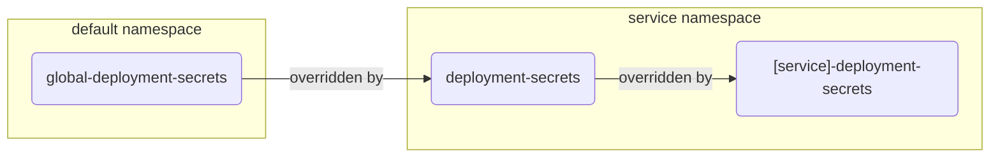

# Secrets

There are various secrets you will see referenced in this repository:

- [Pull Secrets](#PullSecrets)
- [Pipeline Secrets](#PipelineSecrets)
- [Deployment Secrets](#DeploymentSecrets)

## <a name='PullSecrets'></a>Pull Secrets

*What are they*
- This secret is used to access your repository where the service images reside, as well as provide credentials for access.

*How are they used*
- Your image registry should be added to the cluster in the corresponding namespace before a workflow is run within that namespace.

:book: Our examples all use the common `pullsecret` name within the overrides.

####  <a name='Example:'></a>Example:
```
 kubectl create secret docker-registry pullsecret \
--docker-server=repository.path \
--docker-username=user --docker-password=token
```

##  <a name='PipelineSecrets'></a>Pipeline Secrets

*What are they*
- These secrets should be stored within your CI/CD pipeline as the data is sensitive.
- They are **required** for the pipeline to function.

*How are they used*
- To define static environment information for use with the pipeline.
- Stored as a global parameter.

### <a name='GitHubActions'></a>GitHub Actions
:asterisk: Indicates the variable is mandatory.
|:key: Key||:anchor: Default Value |:pencil2: Sample Value|:book: Description
|:-|:-:|:-:|:-:|:-|
HELM_REGISTRY|:asterisk:|-||
HELM_REGISTRY_USER|:asterisk:|-||
HELM_REGISTRY_TOKEN|:asterisk:|-||
IMAGE_REGISTRY|:asterisk:|-|pureengage-docker-staging.jfrog.io|
IMAGE_REGISTRY_USER|:asterisk:|-||
IMAGE_REGISTRY_TOKEN|:asterisk:|-||

### <a name='CloudBuild'></a>Cloud Build
:asterisk: Indicates the variable is mandatory.
|:key: Key||:anchor: Default Value |:pencil2: Sample Value|:book: Description
|:-|:-:|:-:|:-:|:-|
GCPPROJECT|:asterisk:|-|gcpe0003|
GCPREGION|:asterisk:|-|us-east1|
GKECLUSTER|:asterisk:|-|gke2|
IMAGEREGISTRY|:asterisk:|-|pureengage-docker-staging.jfrog.io|
ARTIFACTREPO|:asterisk:|-|helm-staging|
DOMAIN|:asterisk:|-|nlb02-useast1.gcpe003.gencpe.com|
HELM_REGISTRY_USER|:asterisk:|-||
HELM_REGISTRY_TOKEN|:asterisk:|-||
USEGCPSM|:asterisk:|-|true|

##  <a name='DeploymentSecrets'></a>Deployment Secrets

The helm override values are the same for all cluster types, except for a few parameters kept in k8s secrets. We call these **Deployment Secrets**.

This is the recommended method to keep your credentials, tokens, etc. Kubernetes natively provides you with ability to secure your secrets via RBAC.

Within `services` [global default](/services/global-defaults.sh) contains secrets with default values useful for labs, or as a reference when building your own. These are applied at the `global-deployment-secrets` level.

Within each service namespace you can define a namespace specific secret, `deployment-secrets`, or a service specific secret, `[service]-deployment-secrets`,  where `[service]` is replaced with the specific service being used. e.g. `gws-deployment-secrets`  

###  <a name='ProcessforreadingtheDeploymentSecretsDS:'></a>Process for reading the Deployment Secrets (DS):
 - read `global-deployment-secrets` in namespace `default` - stored as a global parameter.
 - read `deployment-secrets` in local/service namespace, if present.
 - read `[service]-deployment-secrets` in local/service namespace, if present.

:bulb: `[service]-deployment-secrets` are useful when you deploy multiple services in the same namespace.



### <a name='global-deployment-secrets'></a>global-deployment-secrets

*What are they*
  - Global secrets are defined in the `default` namespace.
  - All secrets needed for deployment can be stored at this level.

*How are they used*
  - To define static platform information that will not change per service.
  - Stored as a global parameter within the workflow.
### <a name='deployment-secrets'></a>deployment-secrets

*What they are*
  - Defined within the service namespace.
  - These secrets will be the service specific parameters for the workflow. 
  - Available in two levels, `deployment-secrets` and `[service]-deployment-secrets`. Where `[service]` is replaced with the specific service being used. e.g. `gws-deployment-secrets`  

*How they are used*
  - They override `global-deployment-secrets`
  - Stored as a Env variable for use in scripts and overrides. 
### <a name='service-deployment-secrets'></a>\[service\]-deployment-secrets

*What they are*
  - Defined within the service namespace.
  - These secrets will be the service specific parameters for the workflow. 
  - Available in two levels, `deployment-secrets` and `[service]-deployment-secrets`. Where `[service]` is replaced with the specific service being used. e.g. `gws-deployment-secrets`  

*How they are used*
  - They override `global-deployment-secrets`
  - They override `deployment-secrets` 
  - Stored as a Env variable for use in scripts and overrides. 

### <a name='GlobalSecretdetails'></a>Global Secret details

Deployment secrets (DS) are optional, but your per-service code and overrides may require them. Per-service DS are retrieved after global ones, hence you can override parameter globals by locals. Extracted secrets are converted to Env variables and then used in scripts and helm overrides.

Variables are easily identifiable by case:
- `UPPER` is a global variable that can be used by multiple services
- `lower` is a service specific variable, and will be prefaced with the service identifier.


:asterisk: Indicates the variable is mandatory.
|:key: Key||:anchor: Default Value |:pencil2: Sample Value|:book: Description
|:-|-|:-:|:-:|:-:|
DEBUG_HELM||  false |true| To enable global debug options, see [deployment.sh](/services/deployment.sh)
LOCATION||  westus2|usw1|Global environment location setting
CONSUL_DC_LOCATION||westus2||Consul location setting
DOMAIN||  apps.example.com|apps.example.com| Domain address, 
DNS_SCOPE||  cluster.local |cluster.local |internal resolution, important to adjust for GKE with VPC scope
CONSUL_ADDR||consul-server.consul.svc.${DNS_SCOPE}|-|-|
CONSUL_BOOT_TOKEN|:asterisk:|-|-| See consul secret: `consul-bootstrap-acl-token`
REDIS_ADDR||  infra-redis-redis-cluster.infra|redis-cluster.redis|Common REDIS address
REDIS_PORT||  6379|6379|Common REDIS port
REDIS_PASSWORD|:asterisk:|-|redPass| Common REDIS password
POSTGRES_ADDR || postgres-std-postgresql.infra ||Common Postgres DB address 
POSTGRES_PORT ||  5432 | 5432 | Postgres port
POSTGRES_USER ||  postgres|| Postgres admin user
POSTGRES_PASSWORD |:asterisk:| - | pgPass| Postgres admin user password
POSTGRES_STD_ADDR||pgdb-std-postgresql.infra
POSTGRES_GWS_ADDR||pgdb-gws-postgresql.infra
POSTGRES_DGT_ADDR||pgdb-dgt-postgresql.infra
POSTGRES_RPTHIST_ADDR||pgdb-rpthist-postgresql.infra
POSTGRES_RPTRT_ADDR||pgdb-rptrt-postgresql.infra
POSTGRES_UCSX_ADDR||pgdb-ucsx-postgresql.infra
MSSQL_ADDR||mssql-deployment.infra
MSSQL_ADMIN_PASSWORD|:asterisk:|-|MSSQLpass|
KAFKA_ADDR||kafka.kafka|-|As defined by `multicloud-platform` terraform
KAFKA_PORT||9092
ES_ADDR||elastic-es-http.infra||Common elasticsearch address
INGRESS_CLASS||nginx||Ingress class for external
INGRESS_CLASS_INTERNAL||nginx||Ingress class for internal
CERT_ISSUER||ca-cluster-issuer||Certificate issuer as per your cluster.
STORAGE_CLASS_RWO||azure-files||Storage class for RWO
STORAGE_CLASS_RWX||azure-files||Storage class for RWX
STORAGE_CLASS_RWO_PREMIUM||managed-premium||Storage class premium disk
STORAGE_CLASS_PROVISIONER||kubernetes.io/azure-file||Storage class provisioner
GAUTH_NAMESPACE||  gauth||Namespace of GAuth service
GWS_NAMESPACE||  gws||Namespace of GWS service
VOICE_NAMESPACE||voice||Namespace of Voice service
IXN_NAMESPACE||ixn||Namespace of IXN service
PULSE_NAMESPACE||pulse||Namespace of Pulse service
UCSX_NAMESPACE||ucsx||Namespace of UCSX service
TENANT_UUID||  `9350e2fc-a1dd-4c65-8d40-1f75a2e080dd`|`9350e2fc-a1dd-4c65-8d40-1f75a2e080dd`|Tenant unique identifier
TENANT_SID||  100|100|Tenant short-id
SIP_DOMAIN|| t${TENANT_SID}.dev.genazure.com|t100.dev.genazure.com|
gauth_admin_username ||ops|-|GAuth username for deployment of API and CORS
gauth_admin_password_plain||ops|-|GAuth password for deployment of API and CORS
auth_client_gws||-|external_api_client         | gws_client_id in gws
auth_client_gws_ws||-|gws-app-workspace        | wrkspc_client_id in gws
auth_client_gws_prov||-|gws-app-provisioning   | prov_client_id in gws
auth_client_tenant||-|external_api_client      | tenant_gws_client_id in tenant
auth_client_cxc||-|cx_contact                  | cxc_gws_client_id in cxc
auth_client_designer||-|designer_client        | designer_gws_client_id in designer
auth_client_ges||-|ges_client                  | ges_gws_client_id in ges
auth_client_gcxi||-|gcxi_client                | gcxi_gws_client_id in gcxi
auth_client_tlm||-|gws-app-workspace           | tlm_gws_client_id in tlm
auth_client_ucsx||-|ucsx_api_client            | ucsx_gws_client_id in ucsx
auth_client_pulse||-|pulse_client              | pulse_gws_client_id in pulse

### 
Example `.yaml` to create the global secret.

```
Deployment secrets
apiVersion: v1
kind: Secret
type: Opaque
metadata:
  name: global-deployment-secrets
  namespace: default
stringData:
  DEBUG_HELM: "false" 
 
  LOCATION: uswest1
  TENANT_SID: "100"
  TENANT_UUID: "9350e2fc-a1dd-4c65-8d40-1f75a2e080dd"
 
  DOMAIN: nlb01-uswest1.gcpe001.gencpe.net   #external resolution, for ingresses
  DNS_SCOPE: cluster.local
  CONSUL_ADDR: consul-server.consul.svc.cluster.local
  CONSUL_BOOT_TOKEN: a4c9256f-****-****-****-************
 
  REDIS_ADDR: infra-redis-redis-cluster.infra
  REDIS_PASSWORD: secret
  REDIS_PORT: "6379"
 
  POSTGRES_ADDR: pgdb-std-postgresql.infra 
  POSTGRES_PORT: "5432"
  POSTGRES_USER: postgres
  POSTGRES_PASSWORD: secret
  POSTGRES_STD_ADDR: pgdb-std-postgresql.infra
  POSTGRES_GWS_ADDR: pgdb-gws-postgresql.infra
  POSTGRES_DGT_ADDR: pgdb-dgt-postgresql.infra
  POSTGRES_RPTHIST_ADDR: pgdb-rpthist-postgresql.infra
  POSTGRES_RPTRT_ADDR: pgdb-rptrt-postgresql.infra
  POSTGRES_UCSX_ADDR: pgdb-ucsx-postgresql.infra
 
  MSSQL_ADDR: mssql-deployment.infra
  MSSQL_ADMIN_PASSWORD: Genesys@123
 
  KAFKA_ADDR: kafka.infra
  KAFKA_PORT: "9092"
  ES_ADDR: elastic-es-http.infra
  CERT_ISSUER: letsencrypt-prod
 
  STORAGE_CLASS_RWO: standard-rwo
  STORAGE_CLASS_RWX: standard-rwx
  STORAGE_CLASS_RWO_PREMIUM: premium-rwo
  INGRESS_CLASS: nginx
  INGRESS_CLASS_INTERNAL: nginx
```

###  <a name='ServicesSecretDetails'></a>Services Secret Details
You are able to define the secrets used in the service deployment at the `global-deployment-secret` level.

Here are some examples for various services:

```
  gauth_admin_password: $2a$10$7.jOOym2GhhVtpSPXOQmweVqY4gLKOXFbNDRul7UMeP40kQVVx/au
  gauth_admin_password_plain: ops
  gauth_admin_username: ops
  gauth_gws_client_id: external_api_client
  gauth_gws_client_secret: secret
  gauth_jks_keyPassword: genesys
  gauth_jks_keyStorePassword: genesys
  gauth_pg_password: gauth
  gauth_pg_username: gauth
 
  cxc_configserver_user_name: cloudcon
  cxc_configserver_user_password: CloudContact2017!
  cxc_gws_client_id: cx_contact
  cxc_gws_client_secret: secret
  cxc_prov_gwsauthpass: ops
  cxc_prov_gwsauthuser: ops
  cxc_prov_t100_pass: password
  cxc_prov_t100_user: default
 
  designer_gws_client_id: designer_client
  designer_gws_client_secret: secret
 
  gcxi_gws_client_id: gcxi_client
  gcxi_gws_client_secret: secret
 
  gsp_s3_bucket_name: gca-gsp-bucket
  gsp_s3_bucket_host: storage.googleapis.com
  gsp_s3_bucket_port: "443"
  gsp_s3_access_key: GOOG1E*******************************************************
  gsp_s3_secret_key: Zcv1G***********************************
 
  gvp_cm_configserver_password: password
  gvp_cm_configserver_user: default
  gvp_cm_pg_db_password: gvp
  gvp_cm_pg_db_user: gvp
  gvp_rs_mssql_db_password: Genesys@123
  gvp_rs_mssql_db_user: mssqladmin
  gvp_rs_mssql_reader_password: Genesys@123
   
  nexus_db_password: nexus
  nexus_db_user: nexus
  nexus_gws_client_id: nexus_client
  nexus_gws_client_secret: secret
  nexus_tenant_locations: westus1
   
  tlm_gws_client_id: gws-app-workspace
  tlm_gws_client_secret: secret
   
  ges_gws_client_id: ges_client
  ges_gws_client_secret: secret
  ges_db_name: ges
  ges_db_password: ges
  ges_db_user: ges
  ges_devops_password: letmein
  ges_devops_username: admin
  ges_ors_redis_host: redis-ors-stream.service.uswest1.consul
  ges_redis_ors_password: secret
  ges_redis_password: Opstree@1234
 
  iwdem_nexus_api_key: 049111b4-6cac-4e83-a7bf-37c057b45b0f
 
  ucsx_gws_client_id: ucsx_api_client
  ucsx_gws_client_secret: secret
 
  gim_pgdb_etl_name: gim
  gim_pgdb_etl_pass: gim
  gim_pgdb_etl_user: gim
```
